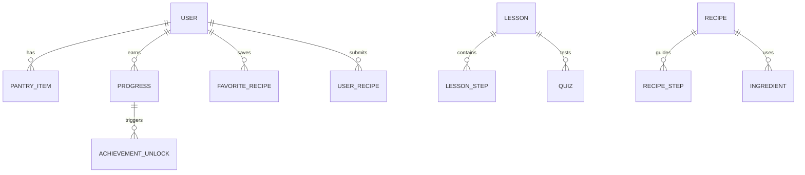

# ZotBites: UCI Healthy Cooking Learning App

This document outlines the architecture, feature set, technology stack, and deployment plan for **ZotBites**, a Duolingo-inspired web app that teaches UCI students how to identify, select, and cook healthy food.

## 🔥 Browser-Based MVP Snapshot
The repository now ships with a functioning MVP located at [`index.html`](../index.html). Open it in any modern browser (or serve locally with `python -m http.server`) to explore the experience without additional build steps.

**What’s included right now**
- **Dual ingredient recognition paths:**
  - *Hosted API:* Upload a food photo and forward it to providers such as LogMeal or CalorieMama by pasting your issued API key—ZotBites handles the multipart request for rapid validation during pilots.
  - *Offline (TensorFlow.js):* Run MobileNet directly in the browser for free/on-device ingredient suggestions when Wi-Fi is limited.
- **Account restriction toggle:** Let only `@uci.edu` emails register or open the app to guests while auto-tagging Anteaters by domain.
- **15 budget-friendly recipes:** Microwave mug omelettes, lentil coconut curry, teriyaki tofu bowls, and more—all under ~$5 per serving with pantry keywords for smart filtering.
- **Gamified lesson flow:** Duolingo-style lesson cards award XP, streaks, and achievements; progress persists in `localStorage`.
- **Pantry-powered recipe finder:** Add ingredients you already own and instantly surface matching meals with cost/time callouts.
- **Community submissions:** Students can post their own recipes or hacks; posts append to a local feed and unlock contributor achievements.

**Local testing tips**
1. Start a lightweight dev server (optional but recommended):
   ```bash
   cd homepage
   python -m http.server 3000
   ```
2. Visit <http://localhost:3000> and interact with the SPA.
3. To test the hosted recognition path, request an API token from your provider and paste it into the form. For offline mode, drag in any JPG/PNG photo of produce or pantry staples.
4. Reset app state by clearing browser storage keys `zotbites_user`, `zotbites_pantry`, and `zotbites_posts`.

Deploying this static MVP to Netlify, Vercel, or GitHub Pages immediately makes it accessible to students while the full-stack architecture below is implemented in phases.

## 1. Product Vision and Target Audience
- **Audience:** UCI students living on or near campus with limited budgets, time, and kitchen experience.
- **Goal:** Deliver a playful, lesson-based experience that builds cooking confidence, supports healthy eating habits, and fosters a student-led community.
- **Value Proposition:** Gamified learning paths, ingredient recognition, budget-friendly recipes, and social features curated for the Anteater community.

## 2. Core Feature Overview
| Pillar | Features | Details |
| --- | --- | --- |
| Ingredient Identification | Visual ingredient cards, scanning/lookup tool, freshness scoring tips | Students learn to recognize quality produce and proteins through interactive guides and optional computer-vision powered recognition. |
| Smart Recipe Finder | Ingredient-based search, dietary filters, affordability indicators | Users input what they have ("pantry mode") and receive tailored recipe suggestions with estimated cost per serving. |
| Guided Cooking Lessons | Step-by-step tutorials, embedded videos/GIFs, timers | Lessons teach fundamental techniques (knife skills, sautéing) and recipe execution with progress tracking. |
| Gamified Learning | Lesson streaks, XP points, skill trees, achievements | Players progress through themed paths ("Freshman Fundamentals", "Dorm Chef", etc.) and earn badges. |
| Student Community | Favorite recipes, user submissions, comments, friend challenges | Emphasizes peer-to-peer learning and localized tips (e.g., best grocery stores near campus). |
| Hosting & Ops | Static frontend + serverless backend | Low-cost stack suitable for student budgets with easy deploy on services such as Vercel, Netlify, or Render. |

## 3. User Experience Flow
1. **Onboarding:** Users sign in with UCI email (optional SSO via Google/OAuth). They select goals (eat healthier, learn basics, meal prep).
2. **Dashboard:** Displays daily streak, XP, current quest, suggested ingredient identification lessons, and recipe recommendations based on saved pantry items.
3. **Learning Paths:** Branching skill trees modeled after course syllabi. Lessons mix ingredient quizzes, cooking minigames, and recipe walkthroughs.
4. **Cooking Session:** Step-by-step instructions with timers, voice prompts, and icons indicating dorm-friendly equipment.
5. **Reflection & Sharing:** Users rate recipes, log what they cooked, share photos, and unlock achievements.

## 4. System Architecture
### 4.1 High-Level Diagram (Conceptual)
```
+--------------------+       +-------------------------+
|  React Frontend    | <---> |  API Gateway / BFF      |
| (Next.js)          |   |   | (Node.js + Express/Nest)|
+--------------------+   |   +-----------+-------------+
                         |               |
                         |               v
                 +-------+------+   +----+------------------+
                 | Lesson/Recipe|   | Ingredient Recognition|
                 | Service      |   | Service (FastAPI CV)  |
                 | (PostgreSQL) |   | + TensorFlow/PyTorch  |
                 +-------+------+   +----+------------------+
                         |               |
                         v               v
                +--------+------+  +-----+-----+
                | Gamification |  | Storage    |
                | Engine       |  | (S3/Supabase)|
                +--------+------+  +-----------+
```
- **Frontend:** Next.js app served statically with client-side hydration. Integrates Tailwind CSS, React Query, and Redux Toolkit for gamification state.
- **Backend:** Node.js (Express or NestJS) for REST/GraphQL API. Optionally use a BFF (Backend For Frontend) pattern to aggregate data.
- **Database:** PostgreSQL (hosted on Supabase or Render) storing users, lessons, recipes, achievements, pantry items.
- **Ingredient Recognition Microservice:** Python FastAPI app exposing image recognition endpoints, backed by a lightweight model (e.g., MobileNet). Deploy separately on Render/Replicate. Can be optional with fallback to manual lookup.
- **Authentication:** Supabase Auth, Firebase Auth, or Auth0 for quick setup with email/OAuth.
- **Storage/CDN:** Supabase storage or AWS S3 for images, lesson media, and user submissions.

### 4.2 Key Data Models

- **User:** profile, campus affiliation, XP, streak, unlocked achievements.
- **Lesson:** metadata (difficulty, tags, prerequisites), type (ingredient ID, technique, recipe).
- **Progress:** tracks lesson completion, daily streak, XP earned.
- **Recipe:** instructions, media, nutrition, cost, equipment list.
- **Community:** favorites, submissions, comments, upvotes.

### 4.3 APIs
- **Auth:** `POST /auth/signup`, `POST /auth/login`, `POST /auth/oauth/callback`
- **Lessons:** `GET /lessons?path=dorm-chef`, `POST /lessons/:id/progress`
- **Gamification:** `GET /users/:id/stats`, `POST /users/:id/xp`
- **Recipe Finder:** `POST /recipes/search` (ingredient list, dietary filters), `GET /recipes/:id`
- **Ingredient Recognition:** `POST /ingredients/detect` (image upload -> predicted ingredient + quality score)
- **Community:** `POST /recipes/:id/favorite`, `POST /recipes/user-submissions`

## 5. Suggested Tech Stack
| Layer | Recommended Tools | Rationale |
| --- | --- | --- |
| Frontend | Next.js (React), TypeScript, Tailwind CSS, Headless UI, React Query | Accessible, SEO-friendly, server-side rendering support, strong ecosystem. |
| Backend | NestJS or Express (TypeScript), tRPC/GraphQL optional | Familiar JS/TS stack with modular architecture. |
| Database | Supabase PostgreSQL (free tier) | Managed Postgres with auth, storage, and REST APIs included. |
| Authentication | Supabase Auth or Clerk | Easy email/OAuth support with minimal setup. |
| Storage | Supabase Storage or AWS S3 | Stores user-uploaded images and lesson assets. |
| Ingredient Recognition | FastAPI + TensorFlow Lite/ONNX model, or integrate Google Cloud Vision | Python ecosystem excels at ML tasks; can deploy as microservice. |
| Hosting | Vercel (frontend), Render/Supabase (backend & DB), Cloudflare R2 (optional) | Low maintenance and student-friendly pricing. |
| CI/CD | GitHub Actions | Automated tests, linting, and deploy triggers. |

## 6. Sample Implementation Snippets
### 6.1 Database Schema (Supabase SQL)
```sql
create table public.users (
  id uuid primary key default uuid_generate_v4(),
  email text unique not null,
  display_name text,
  campus_affiliation text,
  xp integer default 0,
  current_streak integer default 0,
  last_active_date date,
  created_at timestamptz default now()
);

create table public.lessons (
  id uuid primary key default uuid_generate_v4(),
  title text not null,
  path text not null,
  lesson_type text check (lesson_type in ('ingredient', 'technique', 'recipe')),
  difficulty text check (difficulty in ('easy', 'medium', 'hard')),
  description text,
  media_url text,
  prerequisites uuid[]
);

create table public.lesson_steps (
  id uuid primary key default uuid_generate_v4(),
  lesson_id uuid references public.lessons(id) on delete cascade,
  step_number integer not null,
  content jsonb not null,
  constraint unique_step unique (lesson_id, step_number)
);

create table public.user_progress (
  id uuid primary key default uuid_generate_v4(),
  user_id uuid references public.users(id) on delete cascade,
  lesson_id uuid references public.lessons(id) on delete cascade,
  status text check (status in ('not_started', 'in_progress', 'completed')),
  xp_earned integer default 0,
  completed_at timestamptz
);
```

### 6.2 Next.js Ingredient Identification Lesson Component
```tsx
import { useMutation } from '@tanstack/react-query';
import { useState } from 'react';

interface DetectResponse {
  ingredient: string;
  confidence: number;
  freshnessTips: string[];
}

export default function IngredientDetect() {
  const [file, setFile] = useState<File | null>(null);
  const mutation = useMutation<DetectResponse, Error, FormData>({
    mutationFn: async (formData) => {
      const res = await fetch('/api/ingredients/detect', {
        method: 'POST',
        body: formData,
      });
      if (!res.ok) throw new Error('Detection failed');
      return res.json();
    },
  });

  const handleSubmit = () => {
    if (!file) return;
    const formData = new FormData();
    formData.append('image', file);
    mutation.mutate(formData);
  };

  return (
    <div className="rounded-lg border p-4 shadow-sm">
      <h2 className="text-xl font-semibold">Ingredient Scanner</h2>
      <input type="file" accept="image/*" onChange={(e) => setFile(e.target.files?.[0] ?? null)} />
      <button className="btn-primary mt-4" onClick={handleSubmit} disabled={mutation.isLoading}>
        {mutation.isLoading ? 'Analyzing…' : 'Identify Ingredient'}
      </button>

      {mutation.data && (
        <div className="mt-4">
          <p className="text-lg">Looks like: <strong>{mutation.data.ingredient}</strong></p>
          <p>Confidence: {(mutation.data.confidence * 100).toFixed(0)}%</p>
          <ul className="mt-2 list-disc pl-5">
            {mutation.data.freshnessTips.map((tip) => (
              <li key={tip}>{tip}</li>
            ))}
          </ul>
        </div>
      )}

      {mutation.error && <p className="text-red-600">{mutation.error.message}</p>}
    </div>
  );
}
```

### 6.3 FastAPI Ingredient Recognition Endpoint
```python
from fastapi import FastAPI, UploadFile, File
from fastapi.middleware.cors import CORSMiddleware
from PIL import Image
import io

app = FastAPI()
app.add_middleware(
    CORSMiddleware,
    allow_origins=["*"],
    allow_methods=["*"],
    allow_headers=["*"],
)

@app.post("/ingredients/detect")
async def detect_ingredient(image: UploadFile = File(...)):
    contents = await image.read()
    pil_image = Image.open(io.BytesIO(contents))
    # TODO: Run model inference here (e.g., TensorFlow Lite)
    # For demonstration, return a fake response
    prediction = {
        "ingredient": "Bell Pepper",
        "confidence": 0.87,
        "freshnessTips": [
            "Look for firm skin with vibrant color",
            "Avoid peppers with soft spots or wrinkles",
            "Store in the fridge crisper drawer"
        ]
    }
    return prediction
```

### 6.4 Gamification Service (NestJS Controller Example)
```ts
import { Controller, Get, Param } from '@nestjs/common';
import { GamificationService } from './gamification.service';

@Controller('users/:userId/gamification')
export class GamificationController {
  constructor(private readonly service: GamificationService) {}

  @Get('stats')
  getStats(@Param('userId') userId: string) {
    return this.service.getStats(userId);
  }

  @Get('achievements')
  getAchievements(@Param('userId') userId: string) {
    return this.service.listAchievements(userId);
  }
}
```

## 7. Gamified Learning Path Design
1. **Skill Trees:** Organize lessons into themed paths (e.g., "Campus Pantry Basics", "Meal Prep Masters"). Each node requires completing prerequisite nodes.
2. **XP & Streaks:** Award XP for lesson completion, bonus XP for using ingredient scanner, and streak multipliers for daily activity.
3. **Achievements:** Unlock badges for milestones ("First Dorm Dinner", "5 Ingredient Challenge"). Display on user profile.
4. **Seasonal Events:** Tie achievements to campus events (e.g., "Aldrich Park Picnic Week").
5. **Social Challenges:** Allow friendly competitions between roommates or clubs. Use leaderboards limited to selected groups to keep competition friendly.

## 8. Ingredient Recognition Integration Strategy
- **MVP:** Manual lookup with curated ingredient cards featuring photos, selection tips, and freshness indicators.
- **Enhanced:** Integrate the FastAPI service. Upload images from mobile web or file picker. Provide fallback suggestions if confidence < 0.6.
- **Data Source:** Use open datasets such as Fruits 360, Kaggle Vegetable datasets, or SnapCalorie (with licensing review). Fine-tune a MobileNetV3 model and export to TensorFlow Lite for lightweight inference.
- **Quality Scoring:** Pair predictions with rule-based heuristics (color, blemish detection) or crowd-sourced freshness ratings.
- **Privacy:** Warn users to upload photos without identifiable personal info; limit storage duration or anonymize data.

## 9. Development Workflow
1. **Initialize Monorepo (optional):** Use Turborepo or Nx to manage frontend and backend packages.
2. **Set Up Supabase Project:**
   - Create account and project, enable email auth.
   - Run provided SQL schema via Supabase SQL editor.
   - Configure storage buckets for ingredient images.
3. **Bootstrap Frontend:**
   - `npx create-next-app@latest zotbites --ts`
   - Install Tailwind CSS, configure `postcss.config.js` and `tailwind.config.js`.
   - Set up `src/features` directories for lessons, recipes, gamification.
4. **Bootstrap Backend:**
   - `npx nest new api` (TypeScript) or `npm init @eslint/create-express-app`.
   - Install Prisma (optional) to manage Postgres schema. Generate models.
   - Create REST endpoints for lessons, recipes, progress.
5. **Ingredient Service (optional separate repo):**
   - `python -m venv .venv && source .venv/bin/activate`
   - `pip install fastapi uvicorn pillow tensorflow` (use `tensorflow-cpu` for lower resource).
   - Implement inference logic and upload model file.
6. **Connect Frontend to Backend:**
   - Use environment variables for API URLs.
   - Implement SWR/React Query hooks for data fetching.
7. **Gamification Logic:**
   - Define XP/streak rules in backend service.
   - Use cron job or scheduled function (Supabase Edge Functions) to reset streak if user inactive for >24h.

## 10. Beginner-Friendly Deployment Guide
### 10.1 Prerequisites
- GitHub account
- Node.js 18+
- npm or yarn
- Supabase account
- Optional: Render/Vercel accounts for hosting

### 10.2 Local Setup
```bash
# Clone the repo
git clone https://github.com/your-username/zotbites.git
cd zotbites

# Install dependencies
npm install

# Set environment variables (.env.local)
NEXT_PUBLIC_SUPABASE_URL=...
NEXT_PUBLIC_SUPABASE_ANON_KEY=...
API_BASE_URL=http://localhost:4000
```

```bash
# Run Next.js frontend
yarn dev
# or
npm run dev

# Run NestJS backend
yarn start:dev
# or
npm run start:dev

# Run FastAPI service
uvicorn main:app --reload --port 8001
```

### 10.3 Hosting Frontend (Vercel)
1. Push repository to GitHub.
2. Import project in Vercel dashboard.
3. Configure environment variables (`NEXT_PUBLIC_SUPABASE_URL`, etc.).
4. Deploy (Vercel auto-builds Next.js apps).

### 10.4 Hosting Backend (Render)
1. Create new Web Service on Render.
2. Connect to GitHub repo (backend folder).
3. Set build command (`npm install && npm run build`) and start command (`npm run start:prod`).
4. Add environment variables (database URL, Supabase keys).

### 10.5 Hosting Ingredient Service
- Deploy to Render or Railway as Python web service (`uvicorn main:app --host 0.0.0.0 --port 8001`).
- Alternatively, package the model and use Replicate or Hugging Face Inference API for zero-maintenance hosting.

### 10.6 Database Hosting (Supabase)
1. Create Supabase project and note API URL + anon key.
2. Run schema SQL via SQL Editor.
3. Configure Row Level Security policies (e.g., `select` on `lessons` for authenticated users).
4. Enable storage buckets for images; use signed URLs to control access.

### 10.7 CI/CD with GitHub Actions
```yaml
# .github/workflows/deploy.yml
name: CI

on:
  push:
    branches: [ main ]

jobs:
  build:
    runs-on: ubuntu-latest
    steps:
      - uses: actions/checkout@v3
      - uses: actions/setup-node@v3
        with:
          node-version: '18'
      - run: npm install
      - run: npm run lint
      - run: npm run test
```
- Configure Vercel & Render to auto-deploy on `main` pushes.

## 11. Accessibility & Student-Focused Considerations
- **Budget Filters:** Highlight low-cost recipes and show estimated price using store data (e.g., Trader Joe's Irvine).
- **Equipment Level:** Label recipes as "Microwave-Friendly", "Stovetop", "No Kitchen".
- **Nutrition Guidance:** Provide simple macros and healthy tips, disclaiming not medical advice.
- **Offline Access:** Cache key lessons via service workers for dorms with weak Wi-Fi.
- **Localization:** Include UCI-specific references (Anteater theme, campus map for groceries).

## 12. Roadmap
- **Phase 1 (MVP):** Ingredient cards, recipe finder (manual input), lesson modules, basic gamification.
- **Phase 2:** Integrate ingredient recognition ML, add social features, expand recipe library.
- **Phase 3:** Mobile PWA optimizations, analytics dashboards, partnerships with UCI dining.

## 13. Resources & Learning Materials
- Supabase docs: https://supabase.com/docs
- Next.js learn: https://nextjs.org/learn
- FastAPI tutorial: https://fastapi.tiangolo.com/
- TensorFlow transfer learning: https://www.tensorflow.org/tutorials/images/transfer_learning
- Gamification design: "Actionable Gamification" by Yu-kai Chou

---
**Outcome:** Following this guide, a beginner-to-intermediate developer can bootstrap the ZotBites app, integrate ingredient recognition, and deploy a gamified cooking education platform tailored to UCI students.
